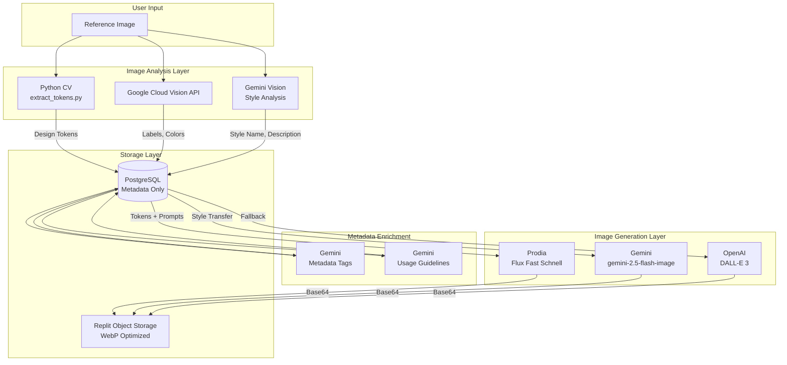
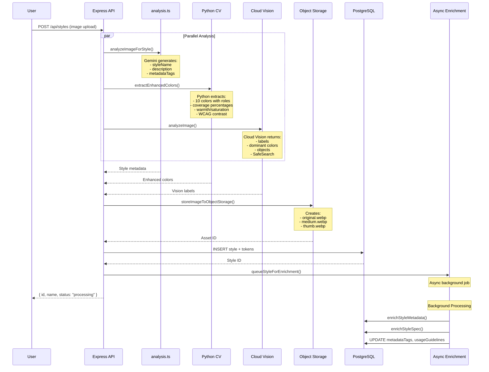
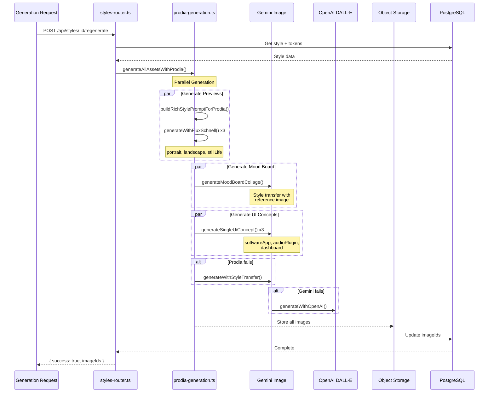
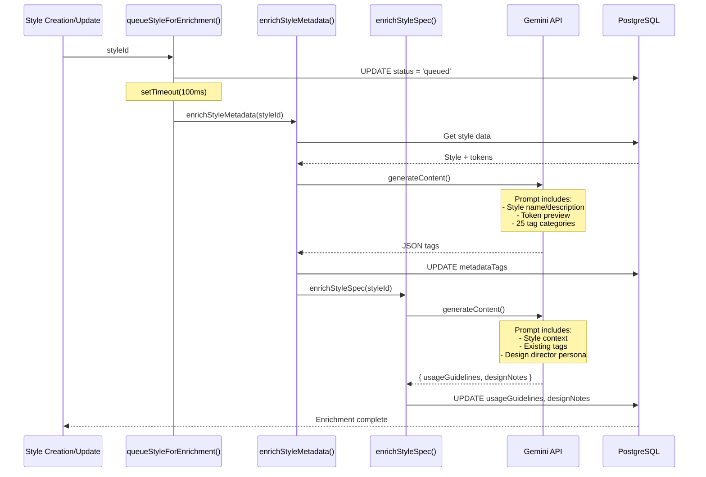
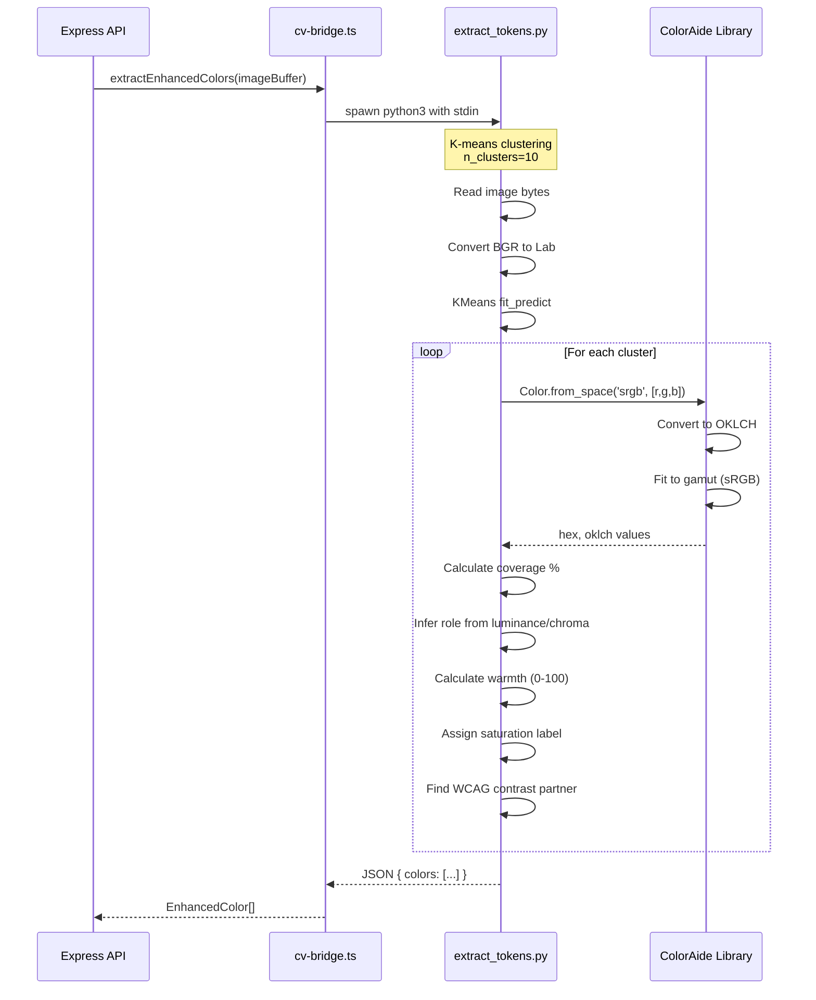
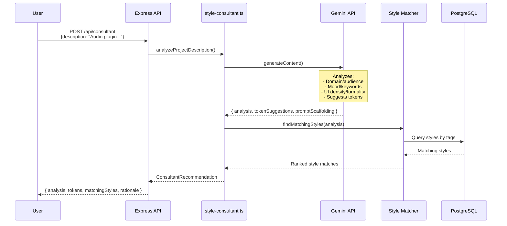
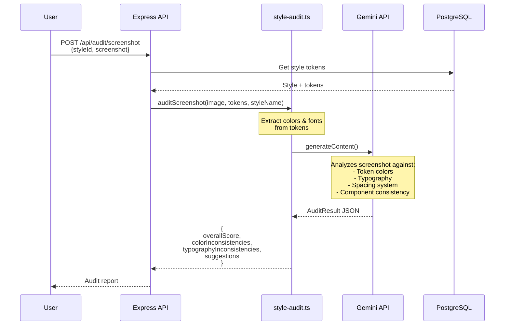
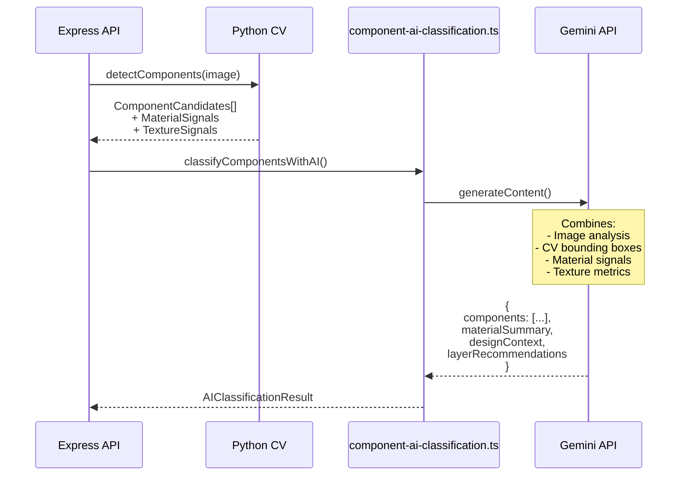
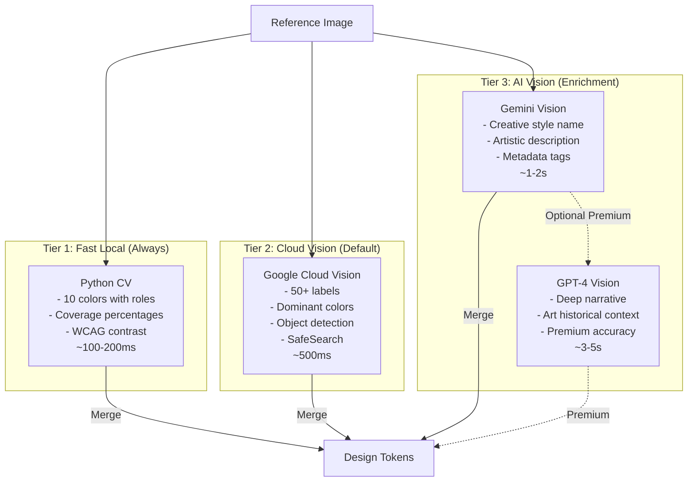
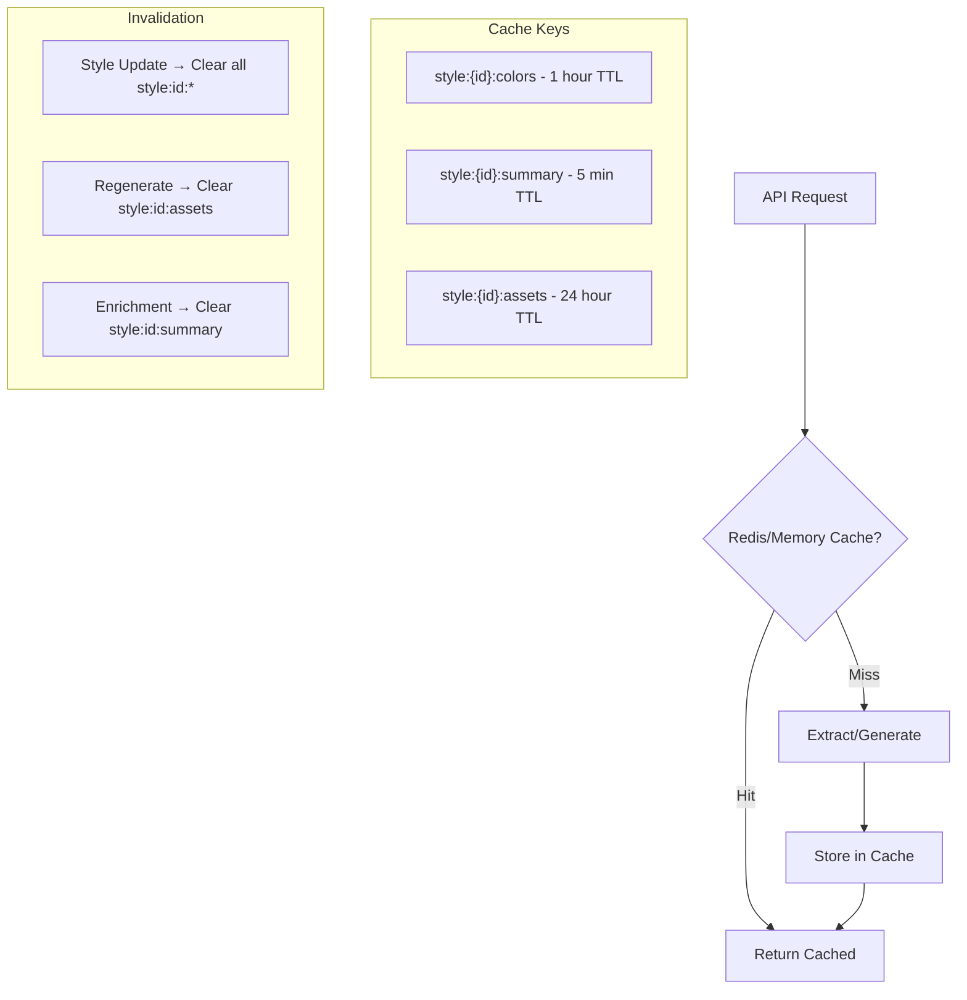

# Visual DNA AI Architecture

This document provides a comprehensive overview of all AI/LLM integrations, prompts, processing flows, and recommendations for the Visual DNA application.

## Table of Contents

1. [Architecture Overview](#architecture-overview)
2. [AI Service Providers](#ai-service-providers)
3. [Image Storage Strategy](#image-storage-strategy)
4. [Complete AI Request Enumeration](#complete-ai-request-enumeration)
5. [Detailed Processing Flows](#detailed-processing-flows)
6. [Prodia Model Evaluation](#prodia-model-evaluation)
7. [Vision API Comparison & Recommendations](#vision-api-comparison--recommendations)
8. [Prompt Templates](#prompt-templates)
9. [Caching Strategy](#caching-strategy)

---

## Architecture Overview

Visual DNA uses a multi-provider AI architecture that balances speed, quality, and cost:



---

## AI Service Providers

### Currently Integrated

| Provider | Service | Model | Purpose |
|----------|---------|-------|---------|
| **Prodia** | Image Generation | Flux Fast Schnell | Primary text-to-image (fast) |
| **Prodia** | Image Generation | Flux Dev | High-quality text-to-image |
| **Gemini** | Image Generation | gemini-2.5-flash-image | Style transfer generation |
| **Gemini** | Vision Analysis | gemini-2.5-flash | Style analysis, metadata enrichment |
| **Google Cloud** | Vision API | Cloud Vision | Labels, colors, objects, OCR, SafeSearch |
| **OpenAI** | Image Generation | DALL-E 3 | Fallback image generation |
| **Python CV** | Color Extraction | OpenCV + ColorAide | Enhanced 10-color palette with roles |

### Configuration

```typescript
// Gemini via Replit AI Integrations
const ai = new GoogleGenAI({
  apiKey: process.env.AI_INTEGRATIONS_GEMINI_API_KEY,
  httpOptions: {
    apiVersion: "",
    baseUrl: process.env.AI_INTEGRATIONS_GEMINI_BASE_URL,
  },
});

// OpenAI via Replit AI Integrations
const openai = new OpenAI({
  apiKey: process.env.AI_INTEGRATIONS_OPENAI_API_KEY,
  baseURL: process.env.AI_INTEGRATIONS_OPENAI_BASE_URL,
});

// Prodia
const prodiaClient = createProdia({ token: process.env.PRODIA_TOKEN });

// Google Cloud Vision
const visionClient = new ImageAnnotatorClient({
  credentials: JSON.parse(process.env.GOOGLE_CLOUD_CREDENTIALS),
});
```

---

## Image Storage Strategy

**All images are stored in Replit Object Storage as WebP - NO base64 in database.**

```mermaid
flowchart LR
    subgraph Input
        B64[Base64 Image Data]
    end
    
    subgraph Processing["server/object-image-service.ts"]
        SHARP[Sharp Processing]
        ORIG[Original WebP<br/>quality: 90]
        MED[Medium 800px<br/>quality: 80]
        THUMB[Thumb 300px<br/>quality: 75]
    end
    
    subgraph Storage["Object Storage"]
        OBJ1[/prefix/id-original.webp]
        OBJ2[/prefix/id-medium.webp]
        OBJ3[/prefix/id-thumb.webp]
    end
    
    subgraph Database["PostgreSQL"]
        META[objectAssets table<br/>- objectKey<br/>- thumbKey<br/>- mediumKey<br/>- dimensions]
    end
    
    B64 --> SHARP
    SHARP --> ORIG --> OBJ1
    SHARP --> MED --> OBJ2
    SHARP --> THUMB --> OBJ3
    
    OBJ1 --> META
    OBJ2 --> META
    OBJ3 --> META
```

### Image Serving

```typescript
// Frontend loads appropriate size
/api/images/:id?size=thumb   // Vault thumbnails (300px)
/api/images/:id?size=medium  // Detail views (800px)
/api/images/:id?size=full    // Downloads (original)
```

---

## Complete AI Request Enumeration

### 1. Image Analysis Requests

| # | Function | File | Model | Purpose |
|---|----------|------|-------|---------|
| 1 | `analyzeImageForStyle()` | server/analysis.ts | gemini-2.5-flash | Generate style name, description, metadata tags |
| 2 | `analyzeReferenceImage()` | server/prodia-generation.ts | gemini-2.5-flash | Analyze subject type, scene description, artistic style |
| 3 | `analyzeRenderingStyle()` | server/replit_integrations/image/client.ts | gemini-2.5-flash | Extract medium, technique, color palette, characteristics |
| 4 | `visionService.analyzeImage()` | server/vision-service.ts | Cloud Vision API | Labels, colors, objects, text, SafeSearch |
| 5 | `extractEnhancedColors()` | server/cv-bridge.ts → Python | OpenCV + ColorAide | 10 colors with roles, coverage, warmth, WCAG |

### 2. Image Generation Requests

| # | Function | File | Model | Purpose |
|---|----------|------|-------|---------|
| 6 | `generateWithFluxSchnell()` | server/prodia-service.ts | Prodia Flux Fast Schnell | Fast preview generation (~190ms) |
| 7 | `generateWithFluxDev()` | server/prodia-service.ts | Prodia Flux Dev | High-quality generation |
| 8 | `generateWithGemini()` | server/replit_integrations/image/client.ts | gemini-2.5-flash-image | Style transfer with reference image |
| 9 | `generateWithOpenAI()` | server/replit_integrations/image/client.ts | DALL-E 3 | Fallback generation |
| 10 | `generateStyledImage()` | server/image-generation.ts | gemini-2.5-flash-image | User "Try It" custom generation |
| 11 | `generateCanonicalPreviews()` | server/preview-generation.ts | gemini-2.5-flash-image | Canonical previews with style transfer |

### 3. Metadata Enrichment Requests

| # | Function | File | Model | Purpose |
|---|----------|------|-------|---------|
| 12 | `enrichStyleMetadata()` | server/metadata-enrichment.ts | gemini-2.5-flash | Generate 25+ tag categories |
| 13 | `enrichStyleSpec()` | server/metadata-enrichment.ts | gemini-2.5-flash | Usage guidelines + design notes |
| 14 | `remixStyles()` | server/remix.ts | gemini-2.5-flash | Blend multiple styles into new tokens |

### 4. Asset Generation Requests

| # | Function | File | Model | Purpose |
|---|----------|------|-------|---------|
| 15 | `generatePreviewImage()` | server/prodia-generation.ts | Prodia/Gemini | Portrait, landscape, still life previews |
| 16 | `generateMoodBoardCollage()` | server/mood-board-generation.ts | gemini-2.5-flash-image | 2x2 mood board collage |
| 17 | `generateSingleUiConcept()` | server/mood-board-generation.ts | gemini-2.5-flash-image | Software app, audio plugin, dashboard |

### 5. Design Consultant & Audit Requests

| # | Function | File | Model | Purpose |
|---|----------|------|-------|---------|
| 18 | `analyzeProjectDescription()` | server/style-consultant.ts | gemini-2.5-flash | Analyze project requirements, suggest tokens & styles |
| 19 | `auditScreenshot()` | server/style-audit.ts | gemini-2.5-flash | Audit UI screenshot for design token compliance |
| 20 | `auditCodeSnippet()` | server/style-audit.ts | gemini-2.5-flash | Audit code for hardcoded values vs tokens |
| 21 | `classifyComponentsWithAI()` | server/component-ai-classification.ts | gemini-2.5-flash | Semantic UI component classification |
| 22 | `generateMaterialTokensWithAI()` | server/component-ai-classification.ts | gemini-2.5-flash | Generate W3C DTCG material/texture tokens |

### 6. Batch Processing Utilities

| # | Function | File | Model | Purpose |
|---|----------|------|-------|---------|
| 23 | `batchProcess()` | server/replit_integrations/batch/utils.ts | Any Gemini | Rate-limited parallel LLM processing |
| 24 | `batchProcessWithSSE()` | server/replit_integrations/batch/utils.ts | Any Gemini | Sequential processing with SSE progress |

### 7. Chat Integration

| # | Function | File | Model | Purpose |
|---|----------|------|-------|---------|
| 25 | Chat streaming endpoint | server/replit_integrations/chat/routes.ts | gemini-2.5-flash | Interactive chat with streaming responses |

---

## Detailed Processing Flows

### Style Creation Flow



### Image Generation Pipeline



### Async Enrichment Flow



### Enhanced Color Extraction Flow



### Style Consultant Flow



### Design Audit Flow



### Component Classification Flow



---

## Prodia Model Evaluation

### Available Models Comparison

| Model | Speed | Quality | Text Render | Prompt Adherence | Best For |
|-------|-------|---------|-------------|------------------|----------|
| **Flux Fast Schnell** | ⭐⭐⭐⭐⭐ (~190ms) | ⭐⭐⭐⭐ | ⭐⭐⭐⭐⭐ | ⭐⭐⭐⭐⭐ | Rapid previews, iteration |
| **Flux Dev** | ⭐⭐⭐ (~3-5s) | ⭐⭐⭐⭐⭐ | ⭐⭐⭐⭐⭐ | ⭐⭐⭐⭐⭐ | Final hero images |
| **SDXL Lightning** | ⭐⭐⭐⭐⭐ (~1s) | ⭐⭐⭐ | ⭐⭐ | ⭐⭐⭐ | Bulk generation |
| **SDXL Base** | ⭐⭐⭐⭐ (~2-3s) | ⭐⭐⭐⭐ | ⭐⭐ | ⭐⭐⭐⭐ | Stylized art |

### Recommended Tiered Strategy

```mermaid
flowchart TD
    REQ[Generation Request]
    
    REQ --> TYPE{Asset Type?}
    
    TYPE -->|Thumbnails| SCHNELL[Flux Fast Schnell<br/>~190ms per image]
    TYPE -->|Previews| SCHNELL
    TYPE -->|Mood Board| GEMINI[Gemini Style Transfer<br/>~2-3s per image]
    TYPE -->|UI Concepts| GEMINI
    TYPE -->|Hero/Download| DEV[Flux Dev<br/>~3-5s per image]
    TYPE -->|User "Try It"| GEMINI
    
    SCHNELL --> STORE[Store to Object Storage]
    GEMINI --> STORE
    DEV --> STORE
```

### Implementation Recommendation

```typescript
// server/prodia-service.ts - Add tiered selection
export type GenerationTier = 'fast' | 'balanced' | 'quality';

export async function generateWithTier(
  options: ProdiaGenerationOptions,
  tier: GenerationTier = 'balanced'
): Promise<ProdiaGenerationResult> {
  switch (tier) {
    case 'fast':
      // Use Flux Fast Schnell for thumbnails/previews
      return generateWithFluxSchnell(options);
    
    case 'quality':
      // Use Flux Dev for hero images
      return generateWithFluxDev(options);
    
    case 'balanced':
    default:
      // Try Schnell first, fallback to Dev on quality issues
      const result = await generateWithFluxSchnell(options);
      return result;
  }
}
```

---

## Vision API Comparison & Recommendations

### Current Implementation

| Layer | Provider | Purpose | Strengths |
|-------|----------|---------|-----------|
| **CV Layer** | Python OpenCV | Color extraction | Fast, local, 10 colors with roles |
| **Cloud Vision** | Google Cloud | Labels, objects, SafeSearch | Structured data, enterprise-grade |
| **AI Vision** | Gemini Flash | Style analysis, creative naming | Contextual understanding, storytelling |

### Recommended Hybrid Architecture



### Provider Comparison

| Feature | Python CV | Google Cloud Vision | Gemini Vision | GPT-4 Vision |
|---------|-----------|---------------------|---------------|--------------|
| **Speed** | ~100ms | ~500ms | ~1-2s | ~3-5s |
| **Cost** | Free | $1.50/1000 images | Included w/ AI Integration | ~$0.01-0.03/image |
| **Color Extraction** | ⭐⭐⭐⭐⭐ (10 colors + roles) | ⭐⭐⭐ (basic) | ⭐⭐⭐ (descriptive) | ⭐⭐⭐⭐ (detailed) |
| **Object Detection** | ❌ | ⭐⭐⭐⭐⭐ | ⭐⭐⭐⭐ | ⭐⭐⭐⭐⭐ |
| **Style Understanding** | ❌ | ⭐⭐ (labels only) | ⭐⭐⭐⭐⭐ | ⭐⭐⭐⭐⭐ |
| **Creative Naming** | ❌ | ❌ | ⭐⭐⭐⭐⭐ | ⭐⭐⭐⭐⭐ |
| **Art Historical Context** | ❌ | ❌ | ⭐⭐⭐⭐ | ⭐⭐⭐⭐⭐ |
| **SafeSearch** | ❌ | ⭐⭐⭐⭐⭐ | ⭐⭐⭐ | ⭐⭐⭐ |

### Recommendation: Hybrid Pipeline

```typescript
// Recommended analysis pipeline
interface AnalysisPipeline {
  // Always run (parallel)
  tier1: {
    pythonCV: true,        // Enhanced colors
    cloudVision: true,     // Labels, SafeSearch
  };
  
  // Default (parallel with tier1)
  tier2: {
    geminiVision: true,    // Style name, description, tags
  };
  
  // Optional premium (async enrichment)
  tier3: {
    gpt4Vision: false,     // Enable for premium accounts
    // Provides: deeper art historical analysis,
    // more accurate keyword tagging (79% vs 36%)
  };
}
```

### GPT-4 Vision Integration (Optional)

If deeper analysis is needed, add GPT-4V for premium enrichment:

```typescript
// server/openai-vision.ts (new file if needed)
export async function analyzeWithGPT4Vision(
  imageBase64: string
): Promise<DetailedAnalysis> {
  const response = await openai.chat.completions.create({
    model: "gpt-4o",
    messages: [{
      role: "user",
      content: [
        { type: "text", text: DETAILED_ANALYSIS_PROMPT },
        { type: "image_url", image_url: { url: `data:image/jpeg;base64,${imageBase64}` }}
      ]
    }]
  });
  
  return JSON.parse(response.choices[0].message.content);
}
```

---

## Prompt Templates

### 1. Style Analysis Prompt (Gemini)

**File:** `server/analysis.ts` - `analyzeImageForStyle()`

```
Analyze this image and generate a creative, memorable style name, description, and visual metadata tags.

Return ONLY valid JSON (no markdown, no code blocks) with exactly this structure:
{
  "styleName": "A creative, concise style name (2-4 words, max 30 chars)",
  "description": "A 1-2 sentence poetic description of the visual style, color palette, mood, and aesthetic.",
  "metadataTags": {
    "mood": ["2-4 mood descriptors like: serene, dramatic, playful, melancholic, vibrant, nostalgic"],
    "colorFamily": ["2-4 color families like: warm, cool, monochrome, pastel, earth tones, jewel tones"],
    "era": ["1-2 era/period like: modern, vintage, retro, futuristic, classical, contemporary"],
    "medium": ["1-3 medium types like: photography, illustration, 3D render, painting, mixed media"],
    "subjects": ["2-4 subject types like: portrait, landscape, still life, abstract, architectural"],
    "lighting": ["1-3 lighting descriptors like: natural, studio, dramatic, soft, golden hour, high contrast"],
    "texture": ["1-3 texture descriptors like: smooth, grainy, rough, glossy, matte, organic"]
  }
}

Consider: Color palette, lighting, atmosphere, texture, surface qualities, compositional balance, and overall mood.
```

### 2. Reference Image Analysis Prompt (Gemini)

**File:** `server/prodia-generation.ts`

```
Analyze this image for art style transfer. Return a JSON object with:
{
  "hasSubject": boolean - true if there's a clear identifiable subject/scene,
  "subjectType": "portrait" | "landscape" | "still_life" | "abstract" | "ui" | "other",
  "sceneDescription": "Detailed 30-50 word description of the scene, subjects, and composition",
  "dominantElements": ["list", "of", "key", "visual", "elements"],
  "artisticStyle": "Brief description of the artistic rendering style (e.g., 'painterly oil', 'digital illustration', 'watercolor wash')"
}
Only return valid JSON, no markdown.
```

### 3. Rendering Style Analysis Prompt (Gemini)

**File:** `server/replit_integrations/image/client.ts`

```
Analyze the artistic rendering style of this image. Identify:
1. The artistic medium (oil painting, watercolor, digital art, photography, etc.)
2. The technique used (impressionist brushwork, flat color, photorealistic, etc.)
3. The color palette approach (muted, vibrant, monochrome, etc.)
4. Key visual characteristics

Return ONLY valid JSON:
{
  "medium": "string describing the artistic medium",
  "technique": "string describing the rendering technique",
  "colorPalette": "string describing the color approach",
  "characteristics": ["array", "of", "key", "visual", "traits"]
}
```

### 4. Styled Image Generation Prompt (Gemini)

**File:** `server/image-generation.ts`

```
Generate an image for the "${styleName}" style.

================================================================================
PRIMARY DIRECTIVE: DESIGN TOKENS (HIGHEST PRIORITY)
================================================================================
The following Design Tokens were extracted from the source image. These are AUTHORITATIVE specifications:

MANDATORY COLOR PALETTE - Use ONLY these exact hex values:
  ${colorPalette.map(c => `${c} (EXACT - no substitution)`).join("\n")}

ALL major color areas in the image MUST use these exact hex values. Do NOT substitute with similar colors.

================================================================================
SECONDARY: STYLE CONTEXT (Use to Inform Technique)
================================================================================
Style Description: ${styleDescription}
Style Base: ${promptScaffolding.base}
Style Modifiers: ${promptScaffolding.modifiers.join(", ")}

================================================================================
USER REQUEST
================================================================================
Concept: ${prompt}

Create a high-quality image that applies the style to the user's concept. The image MUST use the exact Design Token colors listed above. Maintain the style's color palette, mood, lighting, and aesthetic characteristics.
```

### 5. Style Transfer Prompt (Gemini)

**File:** `server/replit_integrations/image/client.ts`

```
CRITICAL STYLE REQUIREMENTS - You MUST follow these exactly:
- Medium: ${renderingStyle.medium}
- Technique: ${renderingStyle.technique}  
- Color palette: ${renderingStyle.colorPalette}
- Style characteristics: ${renderingStyle.characteristics.join(", ")}

DO NOT render as photorealistic. DO NOT use modern digital gradients. 
MATCH the artistic rendering style shown in the reference image exactly.

Subject to render: ${prompt}
```

### 6. Rich Style Prompt for Prodia

**File:** `server/prodia-generation.ts`

```
${subject}

ARTISTIC MEDIUM: ${renderingStyle.medium}.
TECHNIQUE: ${renderingStyle.technique}.
COLOR TREATMENT: ${renderingStyle.colorPalette}.
STYLE TRAITS: ${renderingStyle.characteristics.join(", ")}.

Rendered in ${analysis.artisticStyle} style.
Color palette: ${colors.slice(0, 5).map(c => c.hex).join(", ")}.
${lighting.type} lighting with ${lighting.intensity} intensity.
${texture.finish} finish, ${texture.grain} grain texture.
${mood.tone} mood and atmosphere.

Materials: ${materials.slice(0, 3).join(", ")}.
Textures: ${textures.slice(0, 3).join(", ")}.
Era: ${era.slice(0, 2).join(", ")}.
Mood: ${mood.slice(0, 2).join(", ")}.

Style: "${styleName}".
${styleDescription.slice(0, 200)}
```

### 7. Metadata Enrichment Prompt (Gemini)

**File:** `server/metadata-enrichment.ts`

```
You are an art historian, design critic, and visual culture expert. Analyze this visual style deeply and extract its "Visual DNA" - both objective characteristics and subjective interpretive qualities.

Style Name: ${style.name}
Description: ${style.description}

Design Tokens (excerpt):
${tokensPreview}

Generate tags capturing both technical attributes and subjective essence. Use lowercase, hyphenated keywords.

Respond with ONLY valid JSON in this exact format:
{
  "mood": ["tag1", "tag2"],
  "colorFamily": ["tag1", "tag2"],
  "lighting": ["tag1", "tag2"],
  "texture": ["tag1", "tag2"],
  "depth": ["tag1", "tag2"],
  "shadow": ["tag1", "tag2"],
  "material": ["tag1", "tag2"],
  "atmosphere": ["tag1", "tag2"],
  "environment": ["tag1", "tag2"],
  "era": ["tag1", "tag2"],
  "artPeriod": ["tag1", "tag2"],
  "historicalInfluences": ["influence1", "influence2"],
  "similarArtists": ["artist1", "artist2"],
  "medium": ["tag1", "tag2"],
  "subjects": ["tag1", "tag2"],
  "usageExamples": ["example1", "example2"],
  "narrativeTone": ["tag1", "tag2"],
  "sensoryPalette": ["tag1", "tag2"],
  "movementRhythm": ["tag1", "tag2"],
  "stylisticPrinciples": ["tag1", "tag2"],
  "signatureMotifs": ["tag1", "tag2"],
  "contrastDynamics": ["tag1", "tag2"],
  "psychologicalEffect": ["tag1", "tag2"],
  "culturalResonance": ["tag1", "tag2"],
  "audiencePerception": ["tag1", "tag2"],
  "keywords": ["keyword1", "keyword2"]
}
```

### 8. Usage Guidelines Prompt (Gemini)

**File:** `server/metadata-enrichment.ts`

```
You are a senior design director writing documentation for a visual style system. Based on the style's characteristics, write clear, practical guidance for designers and developers.

Style Name: ${style.name}
Description: ${style.description}

Design Tokens (excerpt):
${tokensPreview}

Metadata Tags:
- Mood: ${metadataTags.mood.join(", ")}
- Color Family: ${metadataTags.colorFamily.join(", ")}
- Lighting: ${metadataTags.lighting.join(", ")}
- Art Period: ${metadataTags.artPeriod.join(", ")}
- Usage Examples: ${metadataTags.usageExamples.join(", ")}
- Stylistic Principles: ${metadataTags.stylisticPrinciples.join(", ")}
- Psychological Effect: ${metadataTags.psychologicalEffect.join(", ")}
- Audience Perception: ${metadataTags.audiencePerception.join(", ")}

Generate two pieces of content:

1. USAGE GUIDELINES (2-3 sentences): When and how to use this style. Be specific about contexts, project types, and appropriate use cases. Start directly with the content, no header.

2. DESIGN NOTES (3-5 sentences): Technical observations about the color palette, typography suggestions, and implementation tips. Include specific recommendations for pairing with other elements. Start directly with the content, no header.

Respond with ONLY valid JSON:
{
  "usageGuidelines": "Your usage guidelines text here...",
  "designNotes": "Your design notes text here..."
}
```

### 9. Mood Board Prompt (Gemini)

**File:** `server/mood-board-generation.ts`

```
Create a 2x2 mood board collage for the "${styleName}" visual style.

Style Description: ${styleDescription}

Color Palette: ${colorList}
Typography: Serif: ${typography.serif}, Sans: ${typography.sans}
Texture: ${texture.finish} finish, ${texture.grain} grain
Lighting: ${lighting.type}, ${lighting.direction}, ${lighting.intensity}
Mood: ${mood.tone}, saturation ${mood.saturation}, contrast ${mood.contrast}

Metadata:
- Mood: ${metadataTags.mood.join(", ")}
- Era: ${metadataTags.era.join(", ")}
- Medium: ${metadataTags.medium.join(", ")}
- Subjects: ${metadataTags.subjects.join(", ")}

Create a cohesive 2x2 grid showing:
1. Top-left: A texture/pattern sample
2. Top-right: A color palette visualization
3. Bottom-left: A typography specimen
4. Bottom-right: A representative scene/subject

The overall image should immediately convey the style's aesthetic.
```

### 10. UI Concept Prompt (Gemini)

**File:** `server/mood-board-generation.ts`

```
Generate a ${conceptType} UI mockup in the "${styleName}" style.

CRITICAL: Match the artistic rendering style of the reference image exactly.
- If the reference is illustrated/painted, render the UI as illustrated/painted
- Maintain the same color treatment, texture, and visual quality
- Apply the style's design tokens to UI elements

Color Palette: ${colorList}
Texture: ${texture.finish} finish
Mood: ${mood.tone}

Create a detailed ${conceptType} interface that embodies this visual style.
```

### 11. Style Consultant Prompt (Gemini)

**File:** `server/style-consultant.ts` - `analyzeProjectDescription()`

```
You are a design consultant analyzing a project description to recommend visual styles and design tokens.

Analyze this project description and extract design requirements:

---
${description}
---

Return ONLY valid JSON (no markdown, no code blocks) with this structure:
{
  "analysis": {
    "domain": "Primary industry/domain (e.g., 'Audio Software', 'Healthcare', 'E-commerce', 'Gaming')",
    "subDomain": "Optional sub-domain (e.g., 'Music Production', 'Patient Management')",
    "targetAudience": "Primary audience (e.g., 'Professional musicians', 'Enterprise users', 'Gen Z consumers')",
    "mood": ["3-5 mood keywords like: minimal, dramatic, playful, cinematic, elegant, bold, serene, edgy"],
    "keywords": ["5-8 design-relevant keywords extracted from the description"],
    "uiDensity": "minimal|moderate|dense based on described UI philosophy",
    "colorTemperature": "warm|cool|neutral|mixed based on implied aesthetic",
    "formality": "professional|casual|playful|serious",
    "aestheticStyle": "One-phrase description like 'Dark cinematic minimalism' or 'Vibrant tech optimism'",
    "platformType": "Type of app/product (e.g., 'Desktop plugin', 'Web dashboard', 'Mobile app')",
    "summary": "2-3 sentence summary of the design direction"
  },
  "tokenSuggestions": {
    "colors": {
      "primary": "#hexcolor - main brand/action color",
      "secondary": "#hexcolor - secondary color",
      "accent": "#hexcolor - highlight/accent",
      "background": "#hexcolor - main background",
      "surface": "#hexcolor - card/panel surfaces",
      "text": "#hexcolor - primary text color"
    },
    "typography": {
      "headingFont": "Font family name for headings",
      "bodyFont": "Font family name for body text",
      "scale": 1.2,
      "weight": "light|regular|medium|bold"
    },
    "spacing": {
      "baseUnit": 8,
      "density": "compact|comfortable|spacious"
    },
    "effects": {
      "borderRadius": "0px|4px|8px|12px|16px|24px|full",
      "shadowStyle": "none|subtle|medium|dramatic",
      "materialHint": "Material/texture description like 'matte aluminum', 'frosted glass', 'soft plastic'"
    },
    "motion": {
      "speed": "instant|quick|moderate|slow",
      "style": "snappy|smooth|elastic|drifting"
    }
  },
  "promptScaffolding": {
    "base": "A detailed base prompt (50-80 words) that would generate images matching this aesthetic.",
    "modifiers": ["4-6 style modifiers like 'cinematic lighting', 'muted tones', 'high contrast'"],
    "negative": "Negative prompt describing what to avoid"
  },
  "rationale": "2-3 sentences explaining why these recommendations fit the project requirements"
}

Be specific with color hex codes. Choose colors that match the mood and domain.
```

### 12. Screenshot Audit Prompt (Gemini)

**File:** `server/style-audit.ts` - `auditScreenshot()`

```
You are a design system auditor. Analyze this UI screenshot against the "${styleName}" style guide.

The style guide defines these colors: ${tokenColors.slice(0, 10).join(", ")}
The style guide defines these fonts: ${tokenTypography.fonts.join(", ") || "system-ui"}

Analyze the screenshot for:
1. Color consistency - Are the colors used matching the style guide?
2. Typography consistency - Are fonts, sizes, and weights consistent?
3. Spacing consistency - Is spacing uniform and following a system?
4. Component consistency - Do similar elements look the same?

Return ONLY valid JSON (no markdown, no code blocks):
{
  "detectedColors": ["#hex1", "#hex2", ...],
  "detectedFonts": ["Font Name 1", "Font Name 2"],
  "colorInconsistencies": [
    {
      "detected": "#hexcolor",
      "expected": "#hexcolor from tokens",
      "location": "button text",
      "severity": "low|medium|high",
      "suggestion": "Use primary color token instead"
    }
  ],
  "typographyInconsistencies": [...],
  "spacingInconsistencies": [...],
  "componentInconsistencies": [...],
  "overallScore": 0-100,
  "colorScore": 0-100,
  "typographyScore": 0-100,
  "spacingScore": 0-100,
  "consistencyScore": 0-100,
  "suggestions": ["list of improvement suggestions"],
  "summary": "Brief audit summary"
}
```

### 13. Code Audit Prompt (Gemini)

**File:** `server/style-audit.ts` - `auditCodeSnippet()`

```
You are a code auditor checking for design token usage consistency.

Analyze this ${fileType} code against the "${styleName}" style guide:

\`\`\`${fileType}
${code.slice(0, 5000)}
\`\`\`

The style guide defines these color tokens: ${tokenColors.slice(0, 10).join(", ")}

Find:
1. Hardcoded color values that should use tokens
2. Hardcoded spacing values that could use a spacing scale
3. Hardcoded font values that should use typography tokens
4. Inconsistent patterns or values

Return ONLY valid JSON:
{
  "tokenUsage": {
    "used": ["--color-primary", "text-primary"],
    "unused": ["--color-accent"],
    "undefined": ["#ff0000 (line 15)"]
  },
  "hardcodedValues": [
    {
      "type": "color|spacing|typography",
      "value": "#ff0000",
      "file": "Button.tsx",
      "line": 15,
      "suggestion": "Use var(--color-error) instead"
    }
  ],
  "inconsistencies": [...],
  "overallScore": 0-100,
  "summary": "Brief audit summary"
}
```

### 14. Component AI Classification Prompt (Gemini)

**File:** `server/component-ai-classification.ts` - `classifyComponentsWithAI()`

```
You are a UI/UX design expert specializing in design system analysis and component recognition.

Analyze this image along with the computer vision analysis results to provide semantic classification of detected UI components and material characteristics.

CV-Detected Components:
Component 1 (id): bbox [x, y, w, h], CV label: "label", aspect_ratio: 1.5, solidity: 0.95
...

Material Signals:
- Translucency: 45%
- Specular density: 30%
- Emission: 10%
- Shadow complexity: 65%

Texture Signals:
- Grain: 20%
- Microcontrast: 55%
- Anisotropy: 15%
- Noise type: gaussian

Based on the image and CV data, provide semantic classification. Return ONLY valid JSON (no markdown):
{
  "components": [
    {
      "id": "component_id from above",
      "originalLabel": "the CV label",
      "aiLabel": "Your semantic label (e.g., 'Primary CTA Button', 'Volume Slider', 'Toggle Switch')",
      "semanticType": "button|slider|toggle|knob|card|container|icon|text|image|input|indicator|other",
      "interactionHint": "tap|drag|rotate|swipe|hover|none",
      "confidence": 0.0 to 1.0
    }
  ],
  "materialSummary": {
    "primaryMaterial": "e.g., frosted glass, brushed metal, soft plastic, matte ceramic",
    "surfaceQuality": "e.g., smooth, textured, embossed, reflective",
    "lightingStyle": "e.g., soft ambient, dramatic spot, neon glow, natural diffuse",
    "depthCharacteristics": "e.g., flat, subtle elevation, deep shadows, floating layers"
  },
  "designContext": {
    "uiFamily": "e.g., skeuomorphic, flat, neumorphic, glassmorphic, brutalist",
    "era": "e.g., modern, retro, futuristic, vintage",
    "platform": "e.g., iOS, Android, web, desktop, embedded",
    "emotionalTone": "e.g., playful, professional, luxurious, minimal, technical"
  },
  "layerRecommendations": ["list of 3-5 recommended layer effects like 'inner glow', 'soft shadow', 'gradient overlay'"]
}
```

### 15. Material Token Generation Prompt (Gemini)

**File:** `server/component-ai-classification.ts` - `generateMaterialTokensWithAI()`

```
You are a W3C Design Tokens expert. Analyze this UI image and the detected material characteristics to generate DTCG 2025.10 compliant design tokens for the material and surface effects.

Detected Material Recipe: ${recipeMatch.label} (confidence: ${recipeMatch.confidence}%)

Material Signals:
- Translucency: ${materialSignals.translucency_score}%
- Specular: ${materialSignals.specular_density}%
- Emission: ${materialSignals.emission_score}%
- Shadow Complexity: ${materialSignals.depth_shadow_complexity}%

Texture Signals:
- Grain: ${textureSignals.texture_grain}%
- Microcontrast: ${textureSignals.microcontrast}%
- Anisotropy: ${textureSignals.anisotropy}%

Generate W3C DTCG tokens that capture the material and texture characteristics. Return ONLY valid JSON (no markdown):
{
  "material": {
    "blur": { "$type": "dimension", "$value": "Xpx", "$description": "Background blur radius" },
    "opacity": { "$type": "number", "$value": 0.X, "$description": "Surface opacity" },
    "saturation": { "$type": "number", "$value": X, "$description": "Backdrop saturation multiplier" }
  },
  "texture": {
    "noise": { "$type": "number", "$value": 0.X, "$description": "Noise overlay intensity" },
    "grain": { "$type": "number", "$value": 0.X, "$description": "Film grain intensity" }
  },
  "lighting": {
    "highlight": {
      "color": { "$type": "color", "$value": "rgba(255,255,255,0.X)", "$description": "Highlight tint" },
      "position": { "$type": "dimension", "$value": "X%", "$description": "Highlight vertical position" }
    },
    "glow": {
      "color": { "$type": "color", "$value": "#XXXXXX", "$description": "Emission glow color" },
      "spread": { "$type": "dimension", "$value": "Xpx", "$description": "Glow spread radius" },
      "intensity": { "$type": "number", "$value": 0.X, "$description": "Glow opacity" }
    }
  },
  "shadow": {
    "ambient": { "$type": "shadow", "$value": "0 Xpx Xpx rgba(0,0,0,0.X)", "$description": "Ambient occlusion shadow" },
    "drop": { "$type": "shadow", "$value": "0 Xpx Xpx rgba(0,0,0,0.X)", "$description": "Drop shadow" }
  },
  "border": {
    "width": { "$type": "dimension", "$value": "Xpx", "$description": "Border width" },
    "color": { "$type": "color", "$value": "rgba(255,255,255,0.X)", "$description": "Border highlight color" }
  }
}
```

---

## Caching Strategy

### Current Implementation

The enhanced colors endpoint currently **bypasses cache** for fresh extractions:

```typescript
// server/routes/styles-router.ts
router.get("/:id/enhanced-colors", async (req, res) => {
  // No cache - always fresh extraction
  const colors = await extractEnhancedColors(styleId);
  res.json({ colors });
});
```

### Recommended Caching Architecture



### Implementation Recommendation

```typescript
// server/cache.ts
import memoizee from 'memoizee';

// In-memory cache with TTL
export const cachedExtractColors = memoizee(
  async (styleId: string) => extractEnhancedColors(styleId),
  { 
    maxAge: 3600000, // 1 hour
    preFetch: true,
    promise: true 
  }
);

// Invalidation helper
export function invalidateStyleCache(styleId: string) {
  cachedExtractColors.delete(styleId);
  // Add other cache invalidations
}
```

---

## Summary

Visual DNA uses a sophisticated multi-provider AI architecture:

1. **Image Analysis**: Python CV (colors) + Cloud Vision (labels) + Gemini (creative analysis)
2. **Image Generation**: Prodia Flux (fast previews) + Gemini (style transfer) + OpenAI (fallback)
3. **Enrichment**: Gemini for metadata tags and usage guidelines
4. **Storage**: All images in Object Storage as optimized WebP, never base64 in database

### Key Optimizations

- **Parallel processing** for all independent AI calls
- **Tiered generation** based on asset type and quality needs
- **Retry logic** with exponential backoff for all AI APIs
- **WebP optimization** at 3 sizes (thumb, medium, full)
- **Async enrichment** to keep style creation fast

### Future Enhancements

1. Add GPT-4 Vision for premium art historical analysis
2. Implement Redis caching for frequently accessed data
3. Add SDXL models for stylized art generation
4. Consider batch processing for bulk operations
