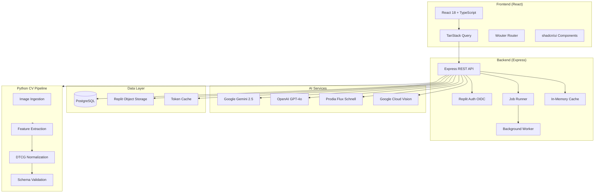
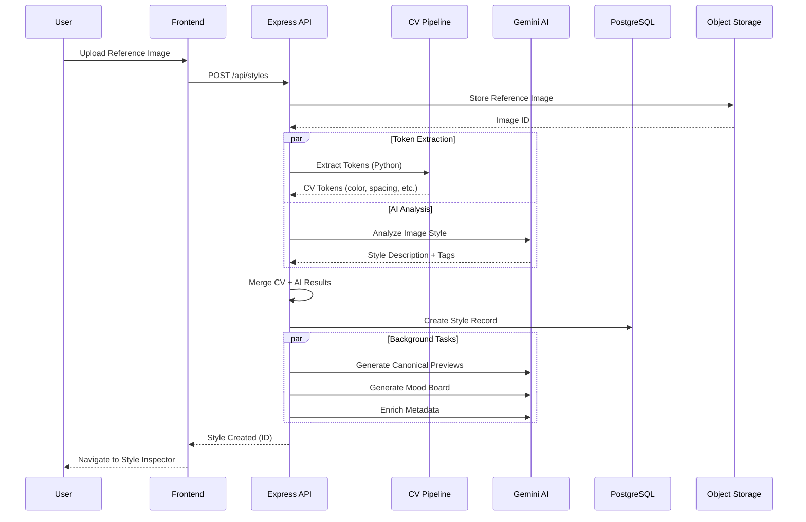
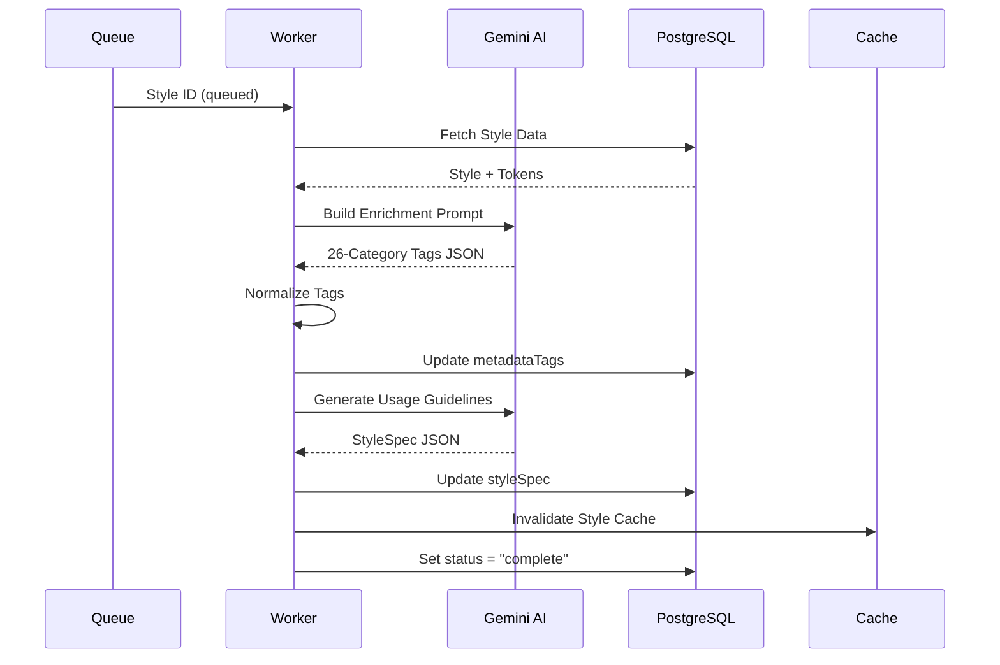
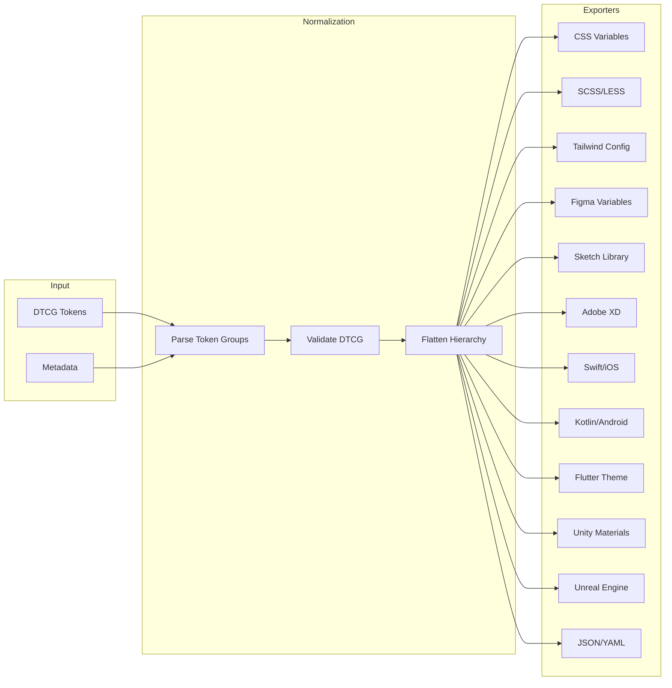
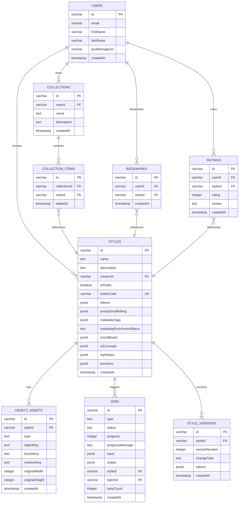

# Visual DNA Studio - Technical Specification

**Version:** 2.0.0  
**Last Updated:** December 28, 2025  
**Status:** Production  

---

## Table of Contents

1. [Executive Summary](#1-executive-summary)
2. [System Architecture](#2-system-architecture)
3. [Feature Analysis](#3-feature-analysis)
4. [Technical Stack](#4-technical-stack)
5. [Algorithm Documentation](#5-algorithm-documentation)
6. [Areas for Improvement](#6-areas-for-improvement)
7. [API Reference](#7-api-reference)
8. [Deployment & Operations](#8-deployment--operations)

---

## 1. Executive Summary

### 1.1 Project Overview

Visual DNA Studio is a W3C DTCG 2025.10-compliant design token and style explorer that treats visual styles as first-class, standards-based artifacts. The platform combines computer vision, AI-powered analysis, and structured token management to create a comprehensive style intelligence system.

### 1.2 Core Value Proposition

- **Styles as Artifacts**: Visual styles are reusable, inspectable, and comparable objects
- **Standards Compliance**: Full W3C DTCG 2025.10 token format support
- **AI-Powered Intelligence**: Automated metadata enrichment, image generation, and style analysis
- **Multi-Format Export**: 18 different export formats for design tools, code, and game engines
- **Community Gallery**: Public style sharing with ratings, bookmarks, and collections

### 1.3 Target Users

| User Segment | Primary Use Cases |
|--------------|-------------------|
| **UI/UX Designers** | Style exploration, token export to Figma/Sketch |
| **Brand Managers** | Style consistency, brand kit generation |
| **Developers** | Token integration, Tailwind/CSS variable export |
| **Game Developers** | Material tokens, Unity/Unreal export |
| **Content Creators** | AI image generation with consistent styles |

### 1.4 Key Metrics

| Metric | Value |
|--------|-------|
| Database Tables | 14 |
| API Endpoints | 80+ |
| Export Formats | 18 |
| AI Providers | 4 (Gemini, OpenAI, Prodia, GCV) |
| Metadata Tags | 26 categories |

---

## 2. System Architecture

### 2.1 High-Level Architecture Diagram



### 2.2 Data Flow: Style Creation Pipeline



### 2.3 Data Flow: Metadata Enrichment



### 2.4 Data Flow: Export Pipeline



### 2.5 Database Entity Relationship Diagram



---

## 3. Feature Analysis

### 3.1 Feature Inventory

| Feature | Status | Files | Dependencies |
|---------|--------|-------|--------------|
| Style Creation | ✅ Complete | `styles-router.ts`, `analysis.ts` | Gemini, CV Pipeline |
| Token Extraction (CV) | ✅ Complete | `cv-bridge.ts`, `pipeline/extract/*` | Python, OpenCV, NumPy |
| Token Extraction (AI) | ✅ Complete | `analysis.ts`, `comprehensive-dtcg.ts` | Gemini |
| Metadata Enrichment | ✅ Complete | `metadata-enrichment.ts` | Gemini |
| Canonical Previews | ✅ Complete | `prodia-generation.ts` | Prodia/Gemini |
| Mood Board Generation | ✅ Complete | `mood-board-generation.ts` | Prodia/Gemini |
| UI Concept Generation | ✅ Complete | `mood-board-generation.ts` | Gemini |
| 18-Format Export | ✅ Complete | `Inspect.tsx` (client-side) | - |
| Object Storage | ✅ Complete | `object-image-service.ts` | Replit Object Storage |
| Background Jobs | ✅ Complete | `job-runner.ts`, `background-worker.ts` | - |
| Retry Logic | ✅ Complete | `retry-utils.ts` | p-retry |
| User Authentication | ✅ Complete | `replit_integrations/auth.ts` | Replit OIDC |
| Bookmarks & Ratings | ✅ Complete | `styles-router.ts`, `storage.ts` | PostgreSQL |
| Collections | ✅ Complete | `styles-router.ts`, `storage.ts` | PostgreSQL |
| Style Versioning | ✅ Complete | `styles-router.ts`, `storage.ts` | PostgreSQL |
| Style Sharing | ✅ Complete | `styles-router.ts` | 6-char codes |
| Typography Recommender | ⚠️ Partial | `typography/*.ts`, `pipeline/extract/typography/*` | - |
| Material Intelligence | ⚠️ Partial | `component-ai-classification.ts` | Gemini |
| One-Click Deploy | ⚠️ Partial | Client-side generation | - |

### 3.2 Feature Deep Dive: Style Creation Pipeline

#### Entry Point
```typescript
// server/routes/styles-router.ts
router.post("/api/styles", async (req, res) => {
  const validatedData = insertStyleSchema.parse(req.body);
  const style = await storage.createStyle(validatedData);
  
  // Background: Store reference image to Object Storage
  if (refImages?.length > 0) {
    await storeImageToObjectStorage(refImages[0], "reference", style.id);
  }
  
  // Background: Generate mood board assets
  generateAllMoodBoardAssets(style.id);
  
  // Background: Queue metadata enrichment
  queueStyleForEnrichment(style.id);
});
```

#### Token Assembly Flow
1. **CV Extraction**: Python pipeline extracts color, spacing, radius, grid, elevation
2. **AI Enhancement**: Gemini adds semantic meaning, names, descriptions
3. **DTCG Normalization**: Tokens converted to W3C standard format
4. **Validation**: Schema validator ensures compliance

### 3.3 Feature Deep Dive: Image Generation

#### Provider Selection Logic
```typescript
// server/prodia-generation.ts
async function selectProvider(type: string): Promise<ImageProvider> {
  if (isProdiaEnabled() && type === "preview") {
    return "prodia";  // Fast, good for previews
  }
  if (type === "ui_concept") {
    return "gemini";  // Better for UI mockups
  }
  return "gemini";  // Default fallback
}
```

#### Canonical Subject System
```typescript
const CANONICAL_SUBJECTS = {
  portrait: "an artist standing in their sunlit atelier studio...",
  landscape: "an elevated stone promenade with ornate railings...",
  stillLife: "a curated arrangement of vintage objects..."
};
```

### 3.4 Feature Deep Dive: Export Pipeline (18 Formats)

| Category | Formats | Implementation |
|----------|---------|----------------|
| **CSS/Web** | CSS Variables, SCSS, LESS, PostCSS | Client-side string generation |
| **JS Frameworks** | Tailwind Config, Theme UI, Chakra UI | JSON + JS object generation |
| **Design Tools** | Figma Variables, Sketch Library, Adobe XD | JSON format per tool spec |
| **Mobile** | Swift (iOS), Kotlin (Android), Flutter | Platform-specific code gen |
| **Game Engines** | Unity C#, Unreal Engine C++ | Material asset generation |
| **Data** | JSON (DTCG), YAML, XML | Serialization |

#### Example: Tailwind Config Export
```typescript
// client/src/pages/Inspect.tsx
const convertTokensToTailwind = (tokens: any, styleName: string): string => {
  const config: any = {
    theme: { extend: { colors: {}, spacing: {}, borderRadius: {}, boxShadow: {} } },
  };
  
  const flattenTokens = (obj: any, prefix = ''): Record<string, string> => {
    const result: Record<string, string> = {};
    for (const [key, value] of Object.entries(obj)) {
      const newKey = prefix ? `${prefix}-${key}` : key;
      if (value && typeof value === 'object' && '$value' in value) {
        result[newKey] = String(value.$value);
      } else if (value && typeof value === 'object') {
        Object.assign(result, flattenTokens(value, newKey));
      }
    }
    return result;
  };
  
  if (tokens.color) config.theme.extend.colors = flattenTokens(tokens.color);
  if (tokens.spacing) config.theme.extend.spacing = flattenTokens(tokens.spacing);
  
  return `module.exports = ${JSON.stringify(config, null, 2)}`;
};
```

### 3.5 Feature Deep Dive: Metadata Enrichment

#### 26-Category Tag System

```typescript
interface MetadataTags {
  // Core Visual (5)
  mood: string[];
  colorFamily: string[];
  lighting: string[];
  texture: string[];
  depth: string[];
  
  // Extended Visual (4)
  shadow: string[];
  material: string[];
  atmosphere: string[];
  environment: string[];
  
  // Art Historical (4)
  era: string[];
  artPeriod: string[];
  historicalInfluences: string[];
  similarArtists: string[];
  
  // Technical (2)
  medium: string[];
  subjects: string[];
  
  // Application (1)
  usageExamples: string[];
  
  // Emotional Resonance (3)
  narrativeTone: string[];
  sensoryPalette: string[];
  movementRhythm: string[];
  
  // Design Voice (3)
  stylisticPrinciples: string[];
  signatureMotifs: string[];
  contrastDynamics: string[];
  
  // Experiential Impact (3)
  psychologicalEffect: string[];
  culturalResonance: string[];
  audiencePerception: string[];
  
  // Search (1)
  keywords: string[];
}
```

---

## 4. Technical Stack

### 4.1 Frontend Architecture

| Layer | Technology | Purpose |
|-------|------------|---------|
| **Framework** | React 18 | Component library |
| **Language** | TypeScript | Type safety |
| **Build** | Vite | Fast HMR, ESM bundling |
| **Routing** | Wouter | Lightweight client routing |
| **State** | TanStack Query | Server state management |
| **Styling** | Tailwind CSS v4 | Utility-first CSS |
| **Components** | shadcn/ui (New York) | Radix-based primitives |
| **Icons** | Lucide React | Icon library |
| **Animation** | Framer Motion | Page transitions |
| **Toasts** | Sonner | Notifications |

#### Component Structure
```
client/src/
├── components/
│   ├── ui/                 # shadcn/ui primitives
│   ├── color-palette-swatches.tsx
│   ├── material-intelligence-panel.tsx
│   ├── style-spec-editor.tsx
│   └── ...
├── pages/
│   ├── Vault.tsx          # Style gallery
│   ├── Inspect.tsx        # Style detail + exports
│   ├── Generate.tsx       # Image generation
│   └── ...
├── hooks/
│   ├── use-auth.ts
│   └── use-mobile.ts
└── lib/
    └── queryClient.ts
```

### 4.2 Backend Architecture

| Layer | Technology | Purpose |
|-------|------------|---------|
| **Runtime** | Node.js 20+ | JavaScript runtime |
| **Framework** | Express | HTTP server |
| **Language** | TypeScript (ESM) | Type safety |
| **ORM** | Drizzle | Type-safe SQL |
| **Database** | PostgreSQL | Relational data |
| **Sessions** | express-session + pg | Session management |
| **Auth** | OpenID Connect | Replit Auth |
| **Bundler** | esbuild | Server compilation |

#### Route Architecture
```
server/routes/
├── index.ts              # Router registration
├── styles-router.ts      # /api/styles/*
├── images-router.ts      # /api/images/*
├── jobs-router.ts        # /api/jobs/*
├── pipeline-router.ts    # /api/pipeline/*
├── vision-router.ts      # /api/vision/*
├── analytics-router.ts   # /api/analytics/*
├── system-router.ts      # /api/health, /api/system/*
└── batch-processing.ts   # Batch operations
```

### 4.3 AI Services Integration

#### Gemini (Primary AI)
```typescript
// server/replit_integrations/ai/client.ts
import { GoogleGenAI } from "@google/genai";

export const ai = new GoogleGenAI({
  apiKey: process.env.AI_INTEGRATIONS_GEMINI_API_KEY,
  httpOptions: {
    apiVersion: "",
    baseUrl: process.env.AI_INTEGRATIONS_GEMINI_BASE_URL,
  },
});

// Usage patterns:
// - Image analysis: gemini-2.5-flash with inlineData
// - Text generation: gemini-2.5-flash with text parts
// - Structured output: JSON mode with schema
```

#### Prodia (Fast Image Generation)
```typescript
// server/prodia-service.ts
const prodia = createProdia({ token: process.env.PRODIA_TOKEN });

export async function generateWithFluxSchnell(prompt: string, options?: {
  aspectRatio?: "1:1" | "16:9" | "9:16";
  steps?: number;
}): Promise<ProdiaGenerationResult> {
  const result = await prodia.v2.generate({
    model: "flux-fast-schnell",
    prompt,
    aspectRatio: options?.aspectRatio || "1:1",
    steps: options?.steps || 4,
  });
  
  return {
    success: true,
    imageUrl: result.imageUrl,
    base64: await fetchAsBase64(result.imageUrl),
  };
}
```

### 4.4 Python CV Pipeline

```
pipeline/
├── extract/
│   ├── color/
│   │   └── color_extraction.py    # K-means clustering
│   ├── typography/
│   │   ├── font_recommender.py    # Font scoring
│   │   └── typography_intent.py   # Style signal inference
│   ├── materials/
│   │   └── material_analysis.py   # Texture detection
│   ├── depth/
│   │   └── depth_extraction.py    # Depth map analysis
│   └── lighting/
│       └── lighting_analysis.py   # Light direction/intensity
├── normalize/
│   ├── dtcg_validator.py          # W3C compliance
│   ├── canonical_assembler.py     # Token assembly
│   └── token_normalizer.py        # Value normalization
├── search/
│   └── semantic_search.py         # Vector similarity
└── api/
    ├── routes.py                  # Flask endpoints
    └── pipeline_orchestrator.py   # Workflow coordination
```

### 4.5 Storage Architecture

#### Object Storage (Replit)
```typescript
// server/object-image-service.ts
const THUMB_WIDTH = 300;
const MEDIUM_WIDTH = 800;

export async function storeImageToObjectStorage(
  base64Data: string,
  type: ImageAssetType,
  styleId?: string
): Promise<string> {
  const buffer = await base64ToBuffer(base64Data);
  
  // Generate WebP variants
  const originalWebp = await sharp(buffer).webp({ quality: 90 }).toBuffer();
  const thumbBuffer = await sharp(buffer).resize(THUMB_WIDTH).webp({ quality: 75 }).toBuffer();
  const mediumBuffer = await sharp(buffer).resize(MEDIUM_WIDTH).webp({ quality: 80 }).toBuffer();
  
  // Upload all variants in parallel
  await Promise.all([
    uploadBuffer(originalPath, originalWebp),
    uploadBuffer(thumbPath, thumbBuffer),
    uploadBuffer(mediumPath, mediumBuffer),
  ]);
  
  // Store reference in database
  const [asset] = await db.insert(objectAssets).values({...});
  return asset.id;
}
```

---

## 5. Algorithm Documentation

### 5.1 Color Extraction (K-Means Clustering)

```python
# pipeline/extract/color/color_extraction.py

def extract_colors(image_path: str, num_colors: int = 8) -> ColorExtractionResult:
    """
    Extract dominant colors using k-means clustering with spatial weighting.
    
    Algorithm:
    1. Load image and sample pixels (10% for performance)
    2. Apply k-means clustering in RGB space
    3. Calculate frequency weight per cluster
    4. Calculate spatial weight (proximity to center)
    5. Combine weights: final = freq * 0.7 + spatial * 0.3
    6. Sort by combined weight
    7. Convert to OKLCH color space
    """
    image = Image.open(image_path).convert('RGB')
    pixels = np.array(image).reshape(-1, 3).astype(float)
    
    # Sample for performance
    sample_size = int(len(pixels) * 0.1)
    indices = np.random.choice(len(pixels), sample_size, replace=False)
    sampled = pixels[indices]
    
    # K-means clustering
    whitened = whiten(sampled)
    centroids, labels = kmeans2(whitened, num_colors, minit='++')
    
    # Calculate weights
    palette = []
    for i in range(num_colors):
        freq_weight = np.sum(labels == i) / len(labels)
        spatial_weight, centroid_pos = compute_spatial_weight(pixels, labels, i, image.size)
        combined_weight = freq_weight * 0.7 + spatial_weight * 0.3
        
        r, g, b = centroids[i] * np.std(sampled, axis=0)
        L, C, H = rgb_to_oklch(int(r), int(g), int(b))
        
        palette.append(ColorPrimitive(
            oklch=(L, C, H),
            frequency=freq_weight,
            spatialWeight=combined_weight,
            centroid=centroid_pos
        ))
    
    return ColorExtractionResult(
        palette=sorted(palette, key=lambda x: -x.spatialWeight),
        dominant=palette[0]
    )
```

### 5.2 Typography Recommendation Scoring

```python
# pipeline/extract/typography/font_recommender.py

DIMENSION_WEIGHTS = {
    'serifness': 2.0,      # Primary classifier
    'weight_bias': 1.0,
    'width_bias': 0.8,
    'formality': 1.2,
    'humanist': 0.9,
    'decorative': 0.7,
    'legibility': 1.1,
    'era': 1.3,
}

def score_font(font: FontMetadata, intent: TypographyIntent) -> float:
    """
    Score a font against inferred typography intent.
    
    Algorithm:
    1. Calculate dimension differences (0-1 scale)
    2. Convert to similarity scores (1 - diff)
    3. Apply dimension weights
    4. Normalize to 0-100 scale
    """
    total_score = 0.0
    total_weight = 0.0
    
    # Serifness match (most important)
    serif_diff = abs(font.serifness - intent.serifness)
    serif_score = 1 - serif_diff
    total_score += serif_score * DIMENSION_WEIGHTS['serifness']
    total_weight += DIMENSION_WEIGHTS['serifness']
    
    # Weight bias match
    weight_diff = abs(font.weight_bias - intent.weight_bias)
    weight_score = 1 - weight_diff
    total_score += weight_score * DIMENSION_WEIGHTS['weight_bias']
    total_weight += DIMENSION_WEIGHTS['weight_bias']
    
    # ... repeat for all dimensions
    
    return (total_score / total_weight) * 100
```

### 5.3 Retry Logic with Exponential Backoff

```typescript
// server/retry-utils.ts

export async function withRetry<T>(
  fn: () => Promise<T>,
  config: RetryConfig = {}
): Promise<T> {
  const { retries, minTimeout, maxTimeout, factor } = {
    retries: 3,
    minTimeout: 1000,
    maxTimeout: 30000,
    factor: 2,
    ...config
  };
  
  return pRetry(
    async () => {
      try {
        return await fn();
      } catch (error) {
        // Only retry transient errors
        if (!isTransientError(error)) {
          throw new AbortError(error.message);
        }
        throw error;
      }
    },
    {
      retries,
      minTimeout,
      maxTimeout,
      factor,
    }
  );
}

function isTransientError(error: unknown): boolean {
  const msg = error.message?.toLowerCase() || '';
  return (
    msg.includes("rate limit") ||
    msg.includes("429") ||
    msg.includes("timeout") ||
    msg.includes("503") ||
    msg.includes("service unavailable")
  );
}
```

### 5.4 Job Runner with Progress Tracking

```typescript
// server/job-runner.ts

export async function runJobWithRetries<TInput, TOutput>(
  jobId: string,
  executor: JobExecutor<TInput, TOutput>,
  config: { maxRetries: number; timeoutMs: number; retryDelayMs: number }
): Promise<{ job: Job; result?: TOutput }> {
  let job = await storage.getJobById(jobId);
  
  while (job.retryCount < config.maxRetries) {
    try {
      await storage.updateJobStatus(job.id, "running", { progress: 0 });
      
      const onProgress = async (progress: number, message: string) => {
        await storage.updateJobStatus(job.id, "running", {
          progress: Math.min(99, Math.max(0, progress)),
          progressMessage: message,
        });
      };
      
      // Race against timeout
      const result = await Promise.race([
        executor(job.input as TInput, onProgress),
        new Promise((_, reject) =>
          setTimeout(() => reject(new Error("Job timed out")), config.timeoutMs)
        ),
      ]);
      
      await storage.updateJobStatus(job.id, "succeeded", {
        progress: 100,
        output: result,
      });
      
      return { job, result };
      
    } catch (error) {
      if (job.retryCount + 1 >= config.maxRetries) {
        await storage.updateJobStatus(job.id, "failed", { error: error.message });
        return { job };
      }
      
      await sleep(config.retryDelayMs * Math.pow(2, job.retryCount));
      job = await storage.getJobById(jobId);
    }
  }
}
```

---

## 6. Areas for Improvement

### 6.1 Critical Technical Debt

| Issue | Severity | Location | Recommendation |
|-------|----------|----------|----------------|
| Enrichment queue reliability | High | `metadata-enrichment.ts` | Add persistent queue (Redis/BullMQ) |
| Missing Material Intelligence display | High | `Inspect.tsx` | Complete panel data binding |
| Typography recommender UI incomplete | Medium | `Inspect.tsx` | Add typography tab with font previews |
| Export functions are client-side only | Medium | `Inspect.tsx` | Move to server for caching/validation |
| Large base64 strings in memory | Medium | Various | Stream to Object Storage immediately |
| No rate limiting on public endpoints | Medium | Routes | Add express-rate-limit middleware |

### 6.2 Performance Bottlenecks

| Bottleneck | Impact | Solution |
|------------|--------|----------|
| Serial image generation | Slow style creation | Already fixed with `Promise.allSettled` |
| Full style fetch for summaries | Slow gallery load | Using `getStyleSummaries()` projection |
| No CDN for Object Storage | Slow image loads | Configure Cloudflare/Fastly CDN |
| Python CV startup time | Cold start latency | Keep-alive worker process |

### 6.3 Unused/Redundant Code

| File/Feature | Status | Action |
|--------------|--------|--------|
| `image-service.ts` | Deprecated | Remove after migration complete |
| `imageAssets` table | Legacy | Migrate remaining to `objectAssets` |
| `random-style-generator.ts` | Dev only | Keep for testing |
| Multiple AI client initializations | Redundant | Consolidate to single client instance |

### 6.4 Missing Features

| Feature | Priority | Effort | Notes |
|---------|----------|--------|-------|
| Style remixing preview | High | Medium | Real-time token blending |
| Collaborative collections | Medium | High | Real-time sync needed |
| Export history | Medium | Low | Track which formats used |
| Style comparison view | Medium | Medium | Side-by-side token diff |
| Batch export | Low | Low | ZIP download of multiple styles |
| Webhook notifications | Low | Medium | Job completion callbacks |

---

## 7. API Reference

### 7.1 Authentication

All authenticated endpoints require the `x-replit-user-id` header or session cookie.

```http
# Session-based auth (browser)
Cookie: connect.sid=<session_id>

# Header-based auth (API)
X-Replit-User-Id: <user_id>
```

### 7.2 Styles Endpoints

#### List Styles
```http
GET /api/styles?limit=20&cursor=<id>&search=<query>&mood=<tags>&sortBy=newest
```

#### Get Style
```http
GET /api/styles/:id
Response: Style object with all fields
```

#### Create Style
```http
POST /api/styles
Content-Type: application/json

{
  "name": "My Style",
  "description": "A warm, vintage aesthetic",
  "tokens": { ... },
  "promptScaffolding": {
    "base": "warm vintage photograph",
    "modifiers": ["film grain", "soft focus"],
    "negative": "harsh, digital"
  },
  "referenceImages": ["data:image/jpeg;base64,..."]
}
```

#### Enrich Style Metadata
```http
POST /api/styles/:id/enrich
Response: {
  "success": true,
  "metadataSuccess": true,
  "specSuccess": true,
  "metadataTags": { ... },
  "styleSpec": { ... }
}
```

#### Export Tokens
```http
GET /api/styles/:id/tokens
Response: { "tokens": { ... } }
```

### 7.3 Images Endpoints

#### Get Image
```http
GET /api/images/:id?size=thumb|medium|full
Response: Binary image data (WebP)
```

#### Store Image
```http
POST /api/images
Content-Type: application/json

{
  "base64": "data:image/jpeg;base64,...",
  "type": "reference|preview_portrait|mood_board|...",
  "styleId": "<uuid>"
}
```

### 7.4 Jobs Endpoints

#### Get Job Status
```http
GET /api/jobs/:id
Response: {
  "id": "...",
  "type": "metadata_enrichment",
  "status": "running",
  "progress": 45,
  "progressMessage": "Analyzing colors..."
}
```

#### List Jobs by Style
```http
GET /api/jobs?styleId=<uuid>
Response: { "jobs": [...] }
```

### 7.5 Error Responses

```typescript
interface ErrorResponse {
  error: string;
  message?: string;
  code?: string;
  details?: Record<string, any>;
}

// Common status codes
// 400 - Bad Request (validation failed)
// 401 - Unauthorized (not authenticated)
// 403 - Forbidden (not authorized)
// 404 - Not Found
// 429 - Rate Limited
// 500 - Internal Server Error
```

---

## 8. Deployment & Operations

### 8.1 Environment Variables

| Variable | Required | Description |
|----------|----------|-------------|
| `DATABASE_URL` | Yes | PostgreSQL connection string |
| `AI_INTEGRATIONS_GEMINI_API_KEY` | Yes | Gemini API key (via Replit) |
| `AI_INTEGRATIONS_GEMINI_BASE_URL` | Yes | Gemini endpoint URL |
| `AI_INTEGRATIONS_OPENAI_API_KEY` | No | OpenAI API key (fallback) |
| `PRODIA_TOKEN` | No | Prodia API token |
| `GOOGLE_CLOUD_VISION_API_KEY` | No | GCV for advanced analysis |
| `CV_EXTRACTION_ENABLED` | No | Enable Python CV pipeline |
| `SESSION_SECRET` | Auto | Session encryption key |
| `DEFAULT_OBJECT_STORAGE_BUCKET_ID` | Auto | Replit Object Storage bucket |

### 8.2 NPM Scripts

```json
{
  "scripts": {
    "dev": "NODE_ENV=development tsx server/index.ts",
    "build": "vite build && esbuild server/index.ts --bundle --platform=node --outdir=dist",
    "start": "NODE_ENV=production node dist/index.js",
    "db:push": "drizzle-kit push",
    "db:push:force": "drizzle-kit push --force",
    "db:studio": "drizzle-kit studio",
    "test": "vitest",
    "test:e2e": "playwright test"
  }
}
```

### 8.3 Logging

```typescript
// server/logger.ts
export const logger = {
  info: (message: string, context?: object) => {
    console.log(JSON.stringify({ level: 'info', message, ...context, ts: new Date().toISOString() }));
  },
  warn: (message: string, context?: object) => {
    console.warn(JSON.stringify({ level: 'warn', message, ...context, ts: new Date().toISOString() }));
  },
  error: (message: string, error?: unknown, context?: object) => {
    console.error(JSON.stringify({ 
      level: 'error', 
      message, 
      error: error instanceof Error ? error.message : String(error),
      stack: error instanceof Error ? error.stack : undefined,
      ...context, 
      ts: new Date().toISOString() 
    }));
  },
};
```

### 8.4 Health Checks

```http
GET /api/health
Response: {
  "status": "healthy",
  "uptime": 123456,
  "database": "connected",
  "objectStorage": "connected"
}
```

### 8.5 One-Click Deploy Configuration

The application generates deployment configs for Vercel and Netlify:

```typescript
// Generated vercel.json
{
  "buildCommand": "npm run build",
  "outputDirectory": "dist/public",
  "framework": "vite",
  "functions": {
    "api/**/*.ts": {
      "runtime": "nodejs20.x"
    }
  }
}

// Generated netlify.toml
[build]
  command = "npm run build"
  publish = "dist/public"

[functions]
  directory = "dist/functions"
```

---

## Appendix A: Token Schema (W3C DTCG 2025.10)

```json
{
  "$schema": "https://design-tokens.github.io/community-group/format/",
  "color": {
    "primary": {
      "$type": "color",
      "$value": "#2A2A2A",
      "$description": "Primary brand color"
    },
    "accent": {
      "$type": "color",
      "$value": "#FF4D4D",
      "$description": "Accent color for CTAs"
    }
  },
  "spacing": {
    "xs": { "$type": "dimension", "$value": "4px" },
    "sm": { "$type": "dimension", "$value": "8px" },
    "md": { "$type": "dimension", "$value": "16px" }
  },
  "typography": {
    "heading": {
      "fontFamily": { "$type": "fontFamily", "$value": "Inter" },
      "fontSize": { "$type": "dimension", "$value": "32px" },
      "fontWeight": { "$type": "fontWeight", "$value": 700 }
    }
  }
}
```

---

## Appendix B: Metadata Tags Example

```json
{
  "mood": ["serene", "nostalgic", "whimsical"],
  "colorFamily": ["earth-tones", "muted-pastels"],
  "lighting": ["soft-diffused", "golden-hour"],
  "texture": ["organic", "film-grain"],
  "depth": ["layered-intricate", "medium-depth"],
  "shadow": ["soft-ambient", "subtle-gradients"],
  "material": ["aged-brass", "enamel", "glass"],
  "atmosphere": ["dreamlike-haze", "ethereal-glow"],
  "environment": ["stylized-studio", "curated-display"],
  "era": ["1920s", "1940s"],
  "artPeriod": ["art-deco", "modernism"],
  "historicalInfluences": ["bauhaus", "japanese-woodblock"],
  "similarArtists": ["alphonse-mucha", "tamara-de-lempicka"],
  "medium": ["oil-painting", "mixed-media"],
  "subjects": ["still-life", "portraits"],
  "usageExamples": ["brand-identity", "editorial", "packaging"],
  "narrativeTone": ["poetic-dreamlike", "intimate-confessional"],
  "sensoryPalette": ["velvet-touch", "autumn-smoke"],
  "movementRhythm": ["flowing-organic", "meditative-slow"],
  "stylisticPrinciples": ["form-follows-function", "wabi-sabi-imperfection"],
  "signatureMotifs": ["curved-lines", "natural-forms"],
  "contrastDynamics": ["subtle-gradients", "harmonious-blend"],
  "psychologicalEffect": ["calming-meditative", "comfort-nostalgia"],
  "culturalResonance": ["japanese-zen", "scandinavian-hygge"],
  "audiencePerception": ["design-professionals", "sophisticated-mature"],
  "keywords": ["vintage", "warm", "organic", "handcrafted", "timeless"]
}
```

---

*Document generated by Visual DNA Studio Technical Documentation System*
